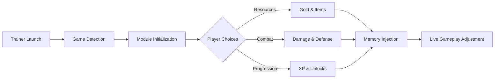

# Blue Prince Trainer

Some games whisper instead of shout. They unfold like a dream remembered in fragments — half strategy, half fairytale. **Blue Prince Trainer** exists for players who want to *listen more closely*, to bend difficulty and pacing without breaking the spell of the world crafted in Blue Prince.

This is a companion tool, not a disruption. A quiet crown resting lightly on your head.

---

## 🏰 Overview

Blue Prince Trainer is a PC-based enhancement software designed to give you **measured authority** over gameplay systems: combat tension, resource scarcity, progression speed, and exploratory freedom.

Instead of brute-force domination, the trainer emphasizes:

* Balance over chaos
* Control over randomness
* Flow over frustration

It adapts to your style — whether you play cautiously, experimentally, or with calculated ambition.

---

## ✨ Feature Highlights

Every module is modular, toggle-driven, and designed to feel like part of the game’s rhythm.

* **Adaptive Resource Control**
  Adjust gold, keys, and consumables to remove grind while preserving strategic choice 💎

* **Combat Tuning Suite**
  Damage multipliers, cooldown refinement, and survivability tweaks for smoother battles ⚔️

* **Exploration Freedom Tools**
  Movement speed and interaction timing adjustments to keep exploration fluid 🗝️

* **Progression Shaping**
  Experience and unlock rate control to match your preferred campaign tempo 📜

* **Fail-Safe Protection**
  Optional god-mode style safeguards for testing builds or narrative exploration 👁‍🗨️

> [!NOTE]
> Each feature can be enabled, adjusted, or disabled at any moment — no restart required.


---

## ⚙️ Setup & First Launch

The setup is intentionally simple — a soft opening, not a ceremony.

1. Start **Blue Prince**
2. Launch Blue Prince Trainer as Administrator
3. Wait for automatic process detection
4. Open the overlay (`Insert` by default)
5. Activate desired modules and adjust values

```text
Run Game → Launch Trainer → Sync Process → Toggle Modules → Continue Play
```

> [!IMPORTANT]
> Always launch the game **before** enabling trainer features to ensure stable memory hooks.

---

## 🧠 System Flow Diagram



Every change happens in real time, without touching game files.

---

## ❓ Frequently Asked Questions

**Is Blue Prince Trainer safe for single-player use?**
Yes. It is designed exclusively for offline, single-player gameplay.

**Will this modify my save files?**
No permanent file changes are made. All effects exist only during runtime.

**Can I create multiple configurations?**
Yes. Profiles allow you to switch instantly between playstyles.

**Does it work after game updates?**
Most minor updates are supported automatically through adaptive scanning.

**Is there a performance impact?**
The trainer runs externally with a minimal footprint — no noticeable FPS loss.

---

## 🌙 Philosophy of Use

Blue Prince is a game about choice, consequence, and quiet calculation. The trainer respects that philosophy. It does not remove decisions — it **refines their weight**.

Use it to:

* Learn systems without punishment
* Explore narrative paths freely
* Test strategies without repetition

Or simply to enjoy the journey at your own pace.

---

## 👑 Final Words

Blue Prince Trainer is not about cheating fate. It is about *negotiating with it*.

A tool for thoughtful players.
A crown that listens.
A balance between power and restraint.

When the game asks you to choose — you will be ready.

---
